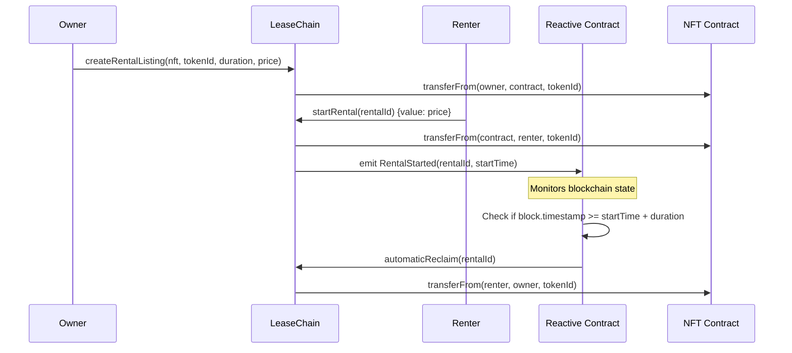

# LeaseChain Technical Documentation

## Table of Contents
- [Architecture Overview](#architecture-overview)
- [Smart Contract Details](#smart-contract-details)
- [Reactive Smart Contract System](#reactive-smart-contract-system)
- [Deployment Guide](#deployment-guide)
- [API Reference](#api-reference)
- [Frontend Architecture](#frontend-architecture)
- [Security Considerations](#security-considerations)
- [Gas Optimization](#gas-optimization)
- [Testing Strategy](#testing-strategy)
- [Network Configurations](#network-configurations)

## Architecture Overview

LeaseChain implements a multi-chain NFT rental protocol with autonomous expiry handling through Reactive Smart Contracts (RSCs). The system consists of three main components:

### Core Components

1. **LeaseChain Contract**: Main rental logic and NFT escrow
2. **LeaseChainReactive Contract**: Monitoring and automatic reclaim
3. **Frontend Application**: User interface for rental operations

### Data Flow



## Smart Contract Details

### LeaseChain.sol

**Primary Functions:**

#### createRentalListing
```solidity
function createRentalListing(
    address nftContract,
    uint256 tokenId,
    uint256 duration,
    uint256 price
) external nonReentrant returns (uint256 rentalId)
```

Creates a rental listing available for anyone to rent.

**Parameters:**
- `nftContract`: Address of the ERC-721 contract
- `tokenId`: ID of the NFT to rent
- `duration`: Rental duration in seconds
- `price`: Rental price in wei

**Requirements:**
- Caller must own the NFT
- NFT must be approved for the LeaseChain contract
- Duration and price must be greater than 0

#### startRental
```solidity
function startRental(uint256 rentalId) external payable nonReentrant
```

Starts a rental by transferring payment and NFT.

**Parameters:**
- `rentalId`: ID of the rental to start

**Requirements:**
- Rental must exist and not be started
- Payment must equal or exceed rental price
- Caller becomes the renter if none assigned

#### automaticReclaim
```solidity
function automaticReclaim(uint256 rentalId) external onlyReactiveContract
```

Automatically reclaims an expired NFT (called by Reactive Contract).

**Access Control:**
- Only callable by the designated Reactive Contract

### Rental Structure

```solidity
struct Rental {
    address nftContract;    // NFT contract address
    uint256 tokenId;       // NFT token ID
    address owner;         // Original NFT owner
    address renter;        // Current renter (0x0 if available)
    uint256 startTime;     // Rental start timestamp
    uint256 duration;      // Rental duration in seconds
    uint256 price;         // Rental price in wei
    bool isActive;         // Whether rental is currently active
    bool isReclaimed;      // Whether NFT has been reclaimed
}
```

### Events

```solidity
event RentalCreated(
    uint256 indexed rentalId,
    address indexed nftContract,
    uint256 indexed tokenId,
    address owner,
    address renter,
    uint256 duration,
    uint256 price
);

event RentalStarted(uint256 indexed rentalId, uint256 startTime);

event RentalReclaimed(
    uint256 indexed rentalId,
    address indexed nftContract,
    uint256 indexed tokenId,
    bool automatic
);
```

## Reactive Smart Contract System

### LeaseChainReactive.sol

The Reactive Smart Contract monitors LeaseChain contracts across multiple chains and automatically triggers reclaim operations when rentals expire.

#### Key Features

1. **Cross-Chain Monitoring**: Monitors multiple LeaseChain deployments
2. **Event Subscription**: Subscribes to RentalStarted events
3. **Automatic Execution**: Calls automaticReclaim when rentals expire
4. **Gas Management**: Manages REACT tokens for continuous operation

#### react() Function

```solidity
function react(
    uint256 chain_id,
    address _contract,
    uint256 topic_0,
    uint256 topic_1,
    uint256 topic_2,
    uint256 topic_3,
    bytes calldata data,
    uint256 block_number,
    uint256 op_code
) external vmOnly
```

Called by the Reactive Network when subscribed events occur.

#### subscribe() Function

```solidity
function subscribe() external {
    bytes memory payload = abi.encodeWithSignature(
        "subscribe(uint256,address,uint256,uint256,uint256,uint256)",
        CHAIN_ID,
        leaseChainAddress,
        RENTAL_STARTED_TOPIC,
        0,
        0,
        0
    );
    (bool success,) = SYSTEM_CONTRACT.call(payload);
    require(success, "Failed to subscribe");
}
```

Subscribes to RentalStarted events from LeaseChain contracts.

## Deployment Guide

### Prerequisites

1. **Environment Variables**:
```bash
PRIVATE_KEY=your_private_key_here
ETHERSCAN_API_KEY=your_etherscan_api_key
BASESCAN_API_KEY=your_basescan_api_key
ARBISCAN_API_KEY=your_arbiscan_api_key
SNOWTRACE_API_KEY=your_snowtrace_api_key
BSCSCAN_API_KEY=your_bscscan_api_key
```

2. **Network Access**: RPC endpoints for all target networks
3. **Test Tokens**: Testnet ETH/AVAX/BNB for deployments

### Deployment Sequence

#### 1. Deploy Core Contracts

```bash
# Deploy to all testnets
npm run deploy:base
npm run deploy:arbitrum
npm run deploy:avalanche
npm run deploy:sonic
npm run deploy:bnb
```

#### 2. Deploy Reactive Contract

```bash
# Deploy to Reactive Network
npm run deploy:reactive
```

#### 3. Connect Reactive Contract

```bash
# Connect reactive contract to all LeaseChain instances
npm run connect:reactive
```

### Manual Deployment

```bash
# Deploy to specific network
npx hardhat run scripts/deploy.js --network baseSepolia

# Verify contracts
npx hardhat verify --network baseSepolia DEPLOYED_ADDRESS
```

## Contract Addresses

### Current Deployments (Fresh - Latest)

#### Base Sepolia (Chain ID: 84532)
- **LeaseChain**: `0xb30fC27A86Aaa9Ad8D7593b137AD4990e5e8E141`
- **TestNFT**: `0x39E98a358dE86114465Cd39DE945e07B1443C94F`
- **Block Explorer**: [Base Sepolia Explorer](https://sepolia-explorer.base.org)

#### Arbitrum Sepolia (Chain ID: 421614)
- **LeaseChain**: `0xAf7F094dc3db86995c84cd8fa7c893Eafb750286`
- **TestNFT**: `0xD5667e049fc5c9c9bdd6b2e31416030133839d8f`
- **Block Explorer**: [Arbiscan Sepolia](https://sepolia.arbiscan.io)

#### Avalanche Fuji (Chain ID: 43113)
- **LeaseChain**: `0x5938191577f48A6b09c802847fF2E2639763a648`
- **TestNFT**: `0xb4336730c7EE24B4Ca466e880277BF95Aff82B04`
- **Block Explorer**: [Snowtrace Testnet](https://testnet.snowtrace.io)

#### Sonic Testnet (Chain ID: 64165)
- **LeaseChain**: `0xA3036d9Ec8D942acd976F0532cC689f1eC667111`
- **TestNFT**: `0x6EcbE0BDD8174ef2422182Eeb89F0857044111b4`
- **Block Explorer**: [Sonic Testnet Explorer](https://testnet.soniclabs.com)

#### BNB Chain Testnet (Chain ID: 97)
- **LeaseChain**: `0x58C53D54319bFCd77b6CD88EdE00c44466BDE035`
- **TestNFT**: `0xA3036d9Ec8D942acd976F0532cC689f1eC667111`
- **Block Explorer**: [BSC Testnet Scan](https://testnet.bscscan.com)

#### Reactive Network (Chain ID: 5318007)
- **LeaseChainReactive**: `0xa20bFD6cC0A0882C16c8c989cd0A0D069aE06471`
- **System Contract**: `0x0000000000000000000000000000000000fffFfF`
- **Block Explorer**: [Reactive Scan](https://kopli.reactscan.net)

## API Reference

### Frontend API Methods

#### createRental(tokenId, pricePerDay, duration, chainId)
Creates a new rental listing.

```javascript
const result = await createRental(tokenId, "0.001", 86400, 84532);
// Returns: { success: boolean, txHash?: string, error?: string }
```

#### startRental(rentalId, chainId)
Starts a rental by paying the rental fee.

```javascript
const result = await startRental(rentalId, 84532);
// Returns: { success: boolean, txHash?: string, error?: string }
```

#### getAllRentals(chainId)
Fetches all rental listings from a specific chain.

```javascript
const rentals = await getAllRentals(84532);
// Returns: Array of rental objects
```

#### getUserNFTs(userAddress, chainId)
Gets NFTs owned by a specific address.

```javascript
const nfts = await getUserNFTs(userAddress, 84532);
// Returns: Array of NFT objects with metadata
```

### Contract Integration

#### Direct Contract Calls

```javascript
import { ethers } from 'ethers';
import LeaseChainABI from './abis/LeaseChain.json';

const contract = new ethers.Contract(contractAddress, LeaseChainABI, signer);

// Create rental
const tx = await contract.createRentalListing(
    nftContract,
    tokenId,
    duration,
    price
);

// Start rental
const tx = await contract.startRental(rentalId, { value: price });
```

## Frontend Architecture

### Component Structure

```
frontend/src/
├── components/
│   ├── CreateRental.js      # NFT listing interface
│   ├── Dashboard.js         # User dashboard
│   ├── RentalList.js       # Marketplace view
│   └── NetworkSwitcher.js   # Network selection
├── api/
│   └── leasechain.js       # Blockchain interaction
├── config/
│   └── contracts.js        # Contract addresses & ABIs
├── utils/
│   └── web3.js            # Web3 utilities
└── App.js                 # Main application
```

### State Management

The application uses React hooks for state management:

- **useWeb3**: Wallet connection and network management
- **useRentals**: Rental data fetching and caching
- **useNFTs**: NFT metadata and ownership

### Network Switching

```javascript
const switchNetwork = async (chainId) => {
    try {
        await window.ethereum.request({
            method: 'wallet_switchEthereumChain',
            params: [{ chainId: `0x${chainId.toString(16)}` }],
        });
    } catch (error) {
        // Handle network switching error
    }
};
```

## Security Considerations

### Smart Contract Security

1. **Reentrancy Protection**: All state-changing functions use `nonReentrant` modifier
2. **Access Control**: Critical functions restricted to authorized callers
3. **Input Validation**: Comprehensive parameter validation
4. **Overflow Protection**: Using Solidity 0.8+ built-in overflow checks

### Key Security Features

#### Reentrancy Guards
```solidity
modifier nonReentrant() {
    require(_status != _ENTERED, "ReentrancyGuard: reentrant call");
    _status = _ENTERED;
    _;
    _status = _NOT_ENTERED;
}
```

#### Access Control
```solidity
modifier onlyReactiveContract() {
    require(msg.sender == reactiveContract, "Only reactive contract can call");
    _;
}
```

#### Safe Transfers
```solidity
// Using OpenZeppelin's SafeERC721
IERC721(rental.nftContract).safeTransferFrom(
    rental.owner,
    rental.renter,
    rental.tokenId
);
```

### Frontend Security

1. **Input Sanitization**: All user inputs validated and sanitized
2. **Transaction Validation**: Verify transaction parameters before signing
3. **Network Verification**: Ensure correct network before operations
4. **Error Handling**: Graceful error handling and user feedback

## Gas Optimization

### Contract Optimizations

1. **Packed Structs**: Efficient struct packing to minimize storage slots
2. **Event Indexing**: Strategic event parameter indexing for efficient filtering
3. **Function Modifiers**: Reusable modifiers to reduce code duplication
4. **Batch Operations**: Support for batch operations where applicable

### Gas Estimates

| Operation | Estimated Gas | USD Cost (30 gwei) |
|-----------|---------------|-------------------|
| Create Rental Listing | ~150,000 | $0.45 |
| Start Rental | ~200,000 | $0.60 |
| Manual Reclaim | ~100,000 | $0.30 |
| Automatic Reclaim | ~120,000 | $0.36 |
| Set Reactive Contract | ~50,000 | $0.15 |

## Testing Strategy

### Contract Testing

```bash
# Run all tests
npm test

# Run specific test file
npx hardhat test test/LeaseChain.test.js

# Run with coverage
npm run test:coverage
```

### Test Categories

1. **Unit Tests**: Individual function testing
2. **Integration Tests**: Multi-contract interactions
3. **End-to-End Tests**: Complete rental flow testing
4. **Security Tests**: Attack vector testing

### Sample Test

```javascript
describe("LeaseChain", function () {
    it("Should create and start rental successfully", async function () {
        // Setup
        const [owner, renter] = await ethers.getSigners();
        
        // Create rental
        const tx = await leaseChain.createRentalListing(
            nft.address,
            tokenId,
            duration,
            price
        );
        
        // Start rental
        await leaseChain.connect(renter).startRental(1, { value: price });
        
        // Verify state
        const rental = await leaseChain.rentals(1);
        expect(rental.renter).to.equal(renter.address);
        expect(rental.isActive).to.be.true;
    });
});
```

## Network Configurations

### RPC Endpoints

```javascript
const networks = {
    baseSepolia: {
        url: "https://sepolia.base.org",
        chainId: 84532,
        gasPrice: "auto"
    },
    arbitrumSepolia: {
        url: "https://sepolia-rollup.arbitrum.io/rpc",
        chainId: 421614,
        gasPrice: "auto"
    },
    avalancheFuji: {
        url: "https://api.avax-test.network/ext/bc/C/rpc",
        chainId: 43113,
        gasPrice: "auto"
    },
    sonicTestnet: {
        url: "https://rpc.testnet.soniclabs.com",
        chainId: 64165,
        gasPrice: "auto"
    },
    bscTestnet: {
        url: "https://data-seed-prebsc-1-s1.binance.org:8545",
        chainId: 97,
        gasPrice: "auto"
    },
    reactive: {
        url: "https://kopli-rpc.rkt.ink",
        chainId: 5318007,
        gasPrice: "auto"
    }
};
```

### Block Explorers

| Network | Explorer URL | API Endpoint |
|---------|-------------|--------------|
| Base Sepolia | https://sepolia-explorer.base.org | https://api-sepolia.basescan.org |
| Arbitrum Sepolia | https://sepolia.arbiscan.io | https://api-sepolia.arbiscan.io |
| Avalanche Fuji | https://testnet.snowtrace.io | https://api-testnet.snowtrace.io |
| Sonic Testnet | https://testnet.soniclabs.com | - |
| BNB Testnet | https://testnet.bscscan.com | https://api-testnet.bscscan.com |
| Reactive | https://kopli.reactscan.net | - |

## Troubleshooting

### Common Issues

#### 1. "Contract not approved" Error
**Solution**: Ensure NFT is approved for LeaseChain contract before creating rental.

```javascript
await nftContract.approve(leaseChainAddress, tokenId);
```

#### 2. "Insufficient payment" Error
**Solution**: Verify payment amount matches rental price exactly.

#### 3. Reactive Contract Not Responding
**Solution**: Check reactive contract balance and subscription status.

```bash
# Check reactive contract balance
cast balance REACTIVE_CONTRACT_ADDRESS --rpc-url REACTIVE_RPC
```

#### 4. Frontend Network Mismatch
**Solution**: Ensure wallet is connected to the correct network.

### Debug Tools

#### Contract State Inspection
```bash
# Check rental details
cast call LEASECHAIN_ADDRESS "rentals(uint256)" RENTAL_ID --rpc-url RPC_URL

# Check next rental ID
cast call LEASECHAIN_ADDRESS "nextRentalId()" --rpc-url RPC_URL
```

#### Event Monitoring
```bash
# Monitor rental events
cast logs --address LEASECHAIN_ADDRESS --rpc-url RPC_URL
```

## Performance Considerations

### Frontend Optimization

1. **React.memo**: Prevent unnecessary re-renders
2. **Lazy Loading**: Load components on demand
3. **API Caching**: Cache blockchain data to reduce RPC calls
4. **Connection Pooling**: Reuse Web3 connections

### Backend Optimization

1. **Batch RPC Calls**: Use multicall for batch operations
2. **Event Filtering**: Efficient event log filtering
3. **State Caching**: Cache contract state for better UX

## Future Enhancements

### Planned Features

1. **Rental Extensions**: Allow extending active rentals
2. **Batch Operations**: Create/start multiple rentals in one transaction
3. **Advanced Pricing**: Dynamic pricing based on demand
4. **Cross-Chain Transfers**: Move rentals between chains
5. **Insurance Integration**: Optional rental insurance
6. **Analytics Dashboard**: Rental statistics and analytics

### Technical Improvements

1. **GraphQL Integration**: Better data querying
2. **IPFS Metadata**: Decentralized metadata storage
3. **Layer 2 Integration**: Additional L2 support
4. **Mobile App**: React Native mobile application

---

*This documentation is maintained by the LeaseChain development team. For questions or clarifications, please open an issue on GitHub.*